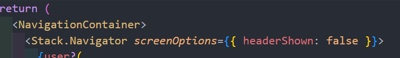

* 
* 
* headerShown:`<false/true>`



* Personalização do cabeçalho: você pode personalizar a aparência da barra de cabeçalho, como ocultá-la ( `headerShown: false`), definir um título personalizado, adicionar botões, etc.

tipo da variavel user,

FirebaseAuthTypes

Quando pensamos em criar uma aplicação, seja ela mobile ou web, nos vem a mente as diversas páginas que a mesma terá. Para tanto é necessário utilizarmos dos recursos de ****navegação ****disponíveis em seus respectivos ambientes.

No ****React Native**** não é diferente, no entanto não vem de forma nativa. Mas para nos salvar temos o ****React Navigation**** que orquestra todo roteamento e navegação de nossa aplicação de forma rápida, direta e muito robusta.

* **StackNavigator** para navegarmos entre telas por botões dentro da tela.
* **TabNavigator** para navegarmos através de abas.
* ****DrawerNavigator**** para navegarmos através um menu lateral.
* 

react-native-dotenv

[https://www.npmjs.com/package/react-native-dotenv](https://www.npmjs.com/package/react-native-dotenv)

```
install -D react-native-dotenv
```
